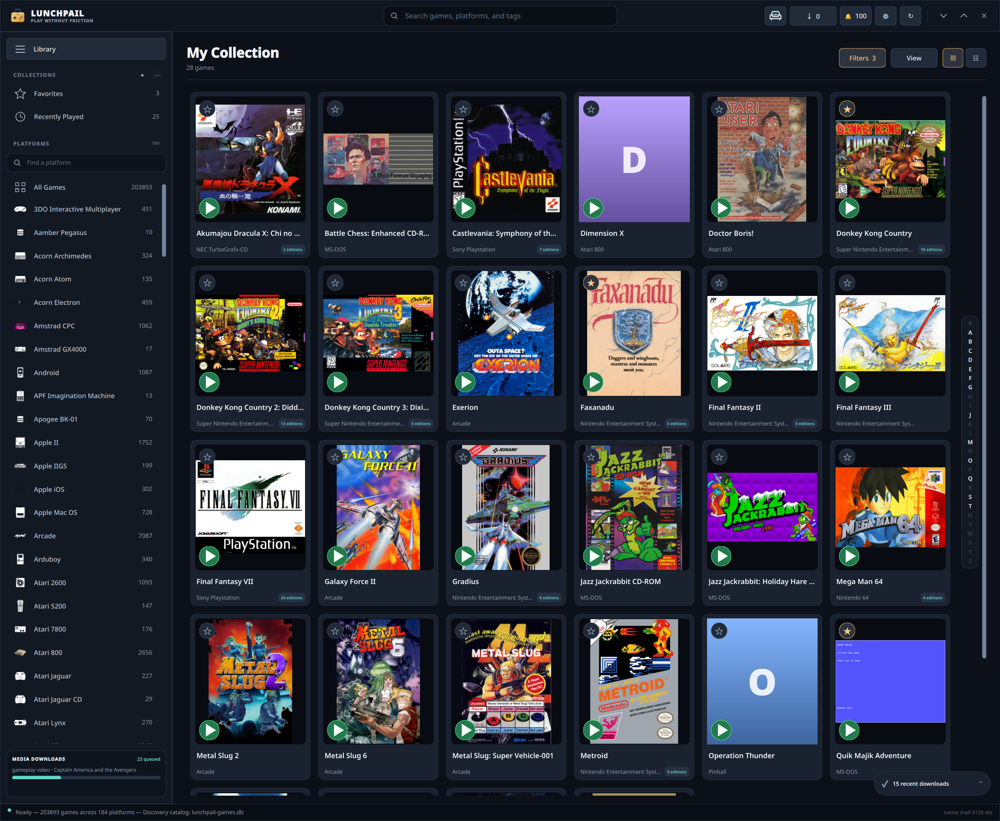

# Lunchbox

Your retro game collection, ready to play.

Lunchbox is a free, open-source game library and emulator frontend for **Windows,
macOS, and Linux**. Browse your collection, discover artwork and translations,
set up controllers, and launch games from one place—at your desk or on the couch.

[Download Lunchbox](https://github.com/benwbooth/lunchbox/releases) ·
[Report an issue](https://github.com/benwbooth/lunchbox/issues) ·
[User guide](docs/README.md)



## What you can do

- **Bring your games together.** Import ROMs and disc images, or manage
  selected-file downloads with optional Minerva and qBittorrent integration.
- **Browse and organize.** Box-art grids, sortable lists, search, favorites,
  collections, regional releases, and play history.
- **Explore each game.** Descriptions, artwork, video previews, manuals, music,
  and interactive 3D boxes, with optional media-provider integrations.
- **Play your way.** Launch RetroArch or standalone emulators, choose defaults
  per system or game, and configure controller mappings for supported emulators.
- **Pick up where you left off.** Automatic save-state resume and save backups
  for supported emulators, including a local folder managed by your sync app.
- **Make it look right.** CRT shaders and system or game-specific bezels,
  with aspect-ratio-preserving artwork on ultrawide displays.
- **Try translations and mods.** Find community patches inside Lunchbox or
  import your own; patched copies leave the original ROM or disc image untouched.
- **Add extras.** RetroArch cheats, RetroAchievements account setup, and
  per-game options such as supported arcade blood settings.
- **Move to the couch.** Cover wall, 3D album, animated logo wheel and classic
  shelf views, with themes, attract mode and access to all game and library tools.

Experimental local AI translation is also available for supported RetroArch
setups. It is opt-in per game, uses OCR and Ollama on a supported GPU, and has a
guided setup wizard. GPU OCR is not yet included in the Linux AppImage or
Flatpak packages. See [translation requirements](docs/translation.md).

## Get started

1. Choose a package from [Releases](https://github.com/benwbooth/lunchbox/releases):
   Windows MSI or portable ZIP, macOS Apple Silicon DMG, or Linux AppImage/Flatpak.
   Nix builds are available too; see the [installation guide](docs/installing.md).
2. Open Lunchbox, choose your storage folders, and use **Library → Import ROMs**
   to add your games. Media accounts and qBittorrent downloads are optional.
3. Select a game, choose an emulator, and press **Play**. Open
   **Settings & mappings** in Game details when you want to customize it.

Lunchbox is under active development. These screenshots and feature notes reflect
the current source; check release notes for what's in each downloadable version.
Games and BIOS files are not included. Use content you have the right to use.

## On the couch

Browse the same collection with a gamepad, keyboard, or mouse.


Screenshots show a configured library. Game artwork belongs to its respective
rights holders; available media depends on your collection and connected providers.

## Learn more

- [Play your first game](docs/getting-started.md).
- [Controllers](docs/controllers.md) · [Display and bezels](docs/display.md) ·
  [Saves and backups](docs/saves.md).
- [Translations, mods, and cheats](docs/patches.md) · [Couch Mode](docs/couch-mode.md).
- [Troubleshooting](docs/troubleshooting.md) · [All guides](docs/README.md).

## Contribute

Built with Rust, Qt, and QML. For incremental development with Nix installed:

```sh
./dev.sh
```

The script enters the development environment when needed, rebuilds changes,
and relaunches Lunchbox. See [Building from source](docs/building.md)
for more options.

Licensed under the [MIT License](LICENSE).
