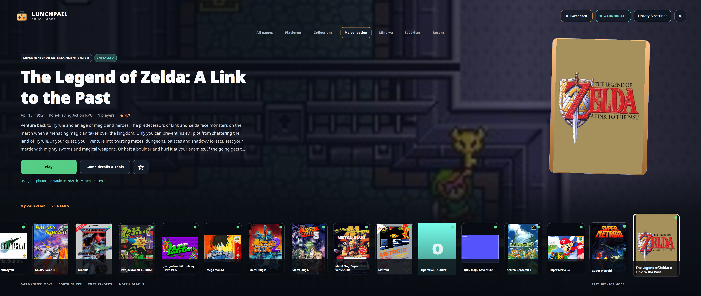

# Couch Mode

Couch Mode is a fullscreen way to browse the same library with a controller,
keyboard, or mouse. Open it from the main window's Couch Mode control.

## Choose a view

| View | Best for |
| --- | --- |
| Cover wall | Seeing many covers at once. |
| Album | Browsing an animated, angled cover flow. |
| Animated wheel | A curved, animated list of game logos. Missing logos use readable titles. |
| Cover shelf | The original horizontal cover row. |

Use the view button, **Library & settings**, or the Couch Mode section in
Settings. Press **V** to cycle views from the keyboard.

Lunchpail remembers the view and keeps the selected game when you switch.

## Browse and play

Choose a shelf such as My Collection, Favorites, or Recent. The platform and
collection pickers narrow the same library used by normal mode.

Use up/down through the wheel, left/right through the album or shelf, and
both directions through the wall. Select a game to see its actions, then choose
Play or download options.

The Game Menu includes favorite, release, view, and attract-mode choices.

## Get to the full tools

**Game details & tools** opens the complete game pane inside the fullscreen
session. Patches, cheats, saves, controllers, display settings, metadata, and
media are not reduced to a separate Couch-only version.

**Library & settings** opens settings, downloads, notifications, imports,
collections, firmware, media tools, and bulk editing. The full library
workspace is available for search, sorting, and organization.

Use **Back to Couch Mode** to return from that workspace without losing the
selected game.

Some advanced forms still use the shared desktop dialogs. Text entry and
native file pickers may need a keyboard or mouse; not every workflow is a
controller-only, TV-sized interface yet.

## Useful controls

- D-pad or left stick: move.
- South face button: select.
- East face button: back or close the current panel.
- Bumpers: page through the focused list.
- **O** on the keyboard: Library & settings.
- **V** on the keyboard: change view.

When a dialog is open, controller navigation stays with that dialog rather
than moving the game list behind it.

## Attract mode, music, and themes

Attract mode tours games from the current shelf. Start it from the Game Menu
or choose an idle delay in Settings.

Background game music is optional and uses available cached media. You can
adjust or mute it in the Couch Mode settings.

See [Themes](themes.md) to change colors and background artwork.

